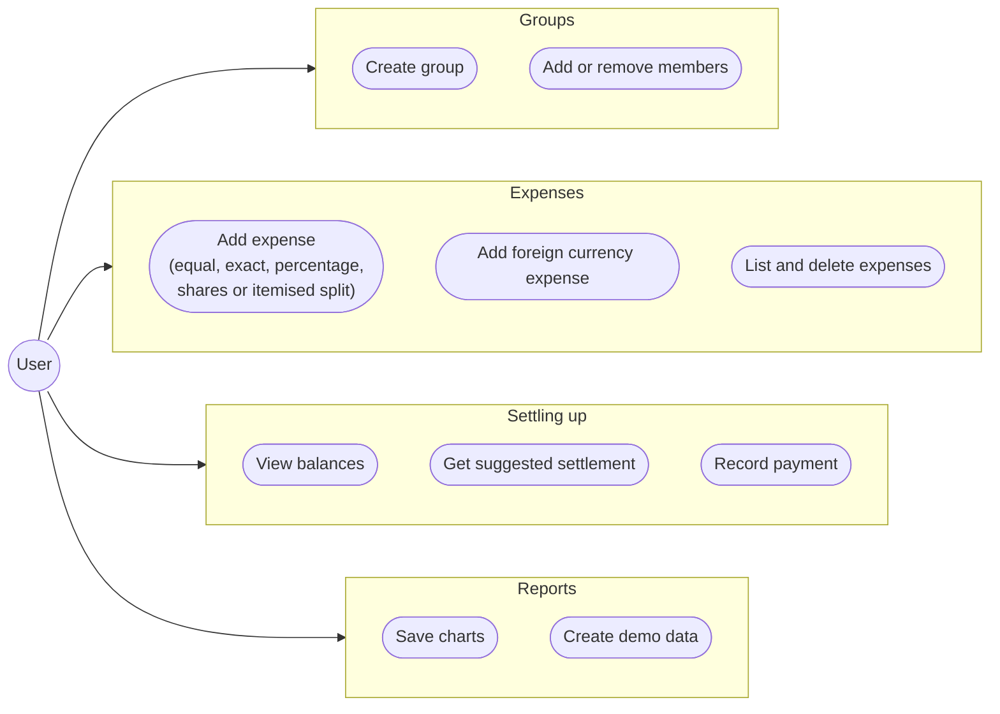
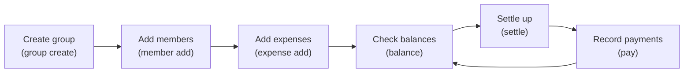
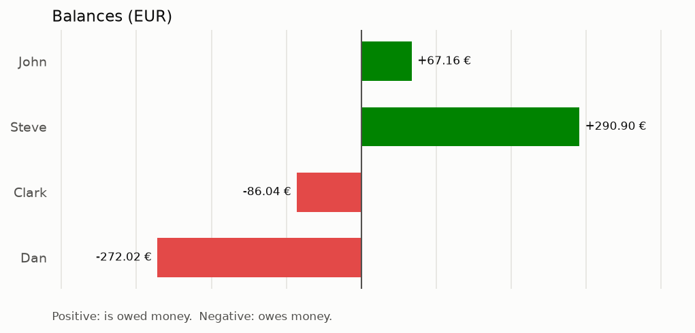
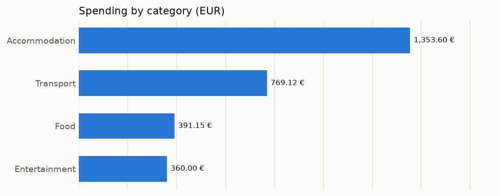
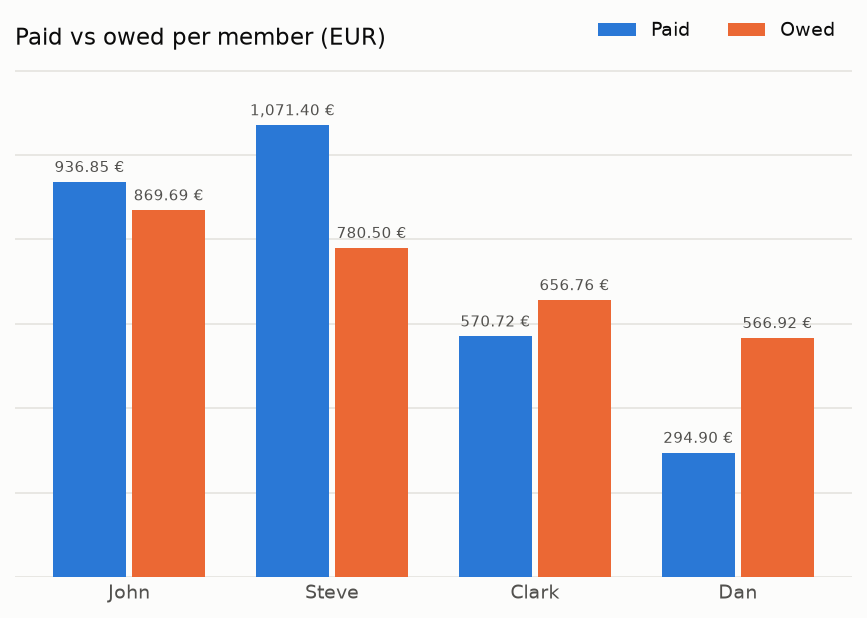

# SplitEasy

[](https://github.com/karnanitace/split-easy/actions/workflows/ci.yml)

SplitEasy is a Python command-line tool and importable library for tracking
shared expenses in groups, such as flatmates or friends on a trip. It records
who paid for what and how each expense is split, works out every member's
balance, and suggests a short list of payments that settles everyone up.
All money is handled as `Decimal`, and every split adds up to the exact cent.

## Contents

- [Features](#features)
- [Use cases](#use-cases)
- [Installation](#installation)
- [Quick start](#quick-start)
- [Example charts](#example-charts)
- [Command reference](#command-reference)
- [Example: an itemised grocery receipt](#example-an-itemised-grocery-receipt)
- [Using SplitEasy as a library](#using-spliteasy-as-a-library)
- [How it works](#how-it-works)
- [Architecture](#architecture)
- [Running tests and linting](#running-tests-and-linting)
- [Future work](#future-work)
- [License](#license)

## Features

- **Groups and members**: create groups with their own currency and add or
  remove members. Names are matched ignoring case (`alice` finds `Alice`).
- **Five ways to split an expense**:
  - **equal**: among everyone, or among chosen members;
  - **exact**: a fixed amount per member;
  - **percentage**: percentages that add up to exactly 100;
  - **shares**: weights such as nights stayed or room sizes;
  - **itemised**: a receipt where each item is shared by different people,
    with discounts and bottle-deposit returns.
- **Foreign currencies**: an expense can be in another currency. Its exchange
  rate is recorded when the expense is entered, so balances never change
  afterwards.
- **Balances and payments**: see what everyone paid, owes and their net
  balance, and record payments between members.
- **Settling up**: get a list of at most *n* − 1 transfers that brings every
  balance to zero.
- **Charts**: save PNG charts of balances, spending per category, and paid
  versus owed per member.
- **Demo data**: one command creates two realistic example groups to explore.
- **Local storage**: everything is saved in a single SQLite file.
- **Library API**: every feature of the CLI is available from Python through
  `GroupService`.

## Use cases

The diagram shows what a user can do with SplitEasy, grouped by area.



## Installation

SplitEasy needs Python 3.10 or newer and uses [uv](https://docs.astral.sh/uv/).

```bash
git clone https://github.com/karnanitace/split-easy.git
cd split-easy
uv venv
uv pip install -e .
```

To also install the development tools (pytest, hypothesis and ruff):

```bash
uv pip install -e ".[dev]"
```

### Where your data is stored

SplitEasy keeps all groups in one local SQLite database file, using Python's
built-in `sqlite3` module, so **no database server needs to be installed**.
By default the file is:

| System | Default location |
| --- | --- |
| Linux and macOS | `~/.spliteasy/spliteasy.db` |
| Windows | `C:\Users\<name>\.spliteasy\spliteasy.db` |

The folder is created automatically. To use another file, pass `--db` before
the command, or set the `SPLITEASY_DB` environment variable:

```bash
uv run -m spliteasy --db trip.db group list
SPLITEASY_DB=trip.db uv run -m spliteasy group list
```

## Quick start

A typical workflow, with the command for each step:



Create the demo groups: a flat shared by John and Steve, and a trip to Italy
with John, Steve, Clark and Dan.

```bash
uv run -m spliteasy demo --yes
```

The command prints the trip's balances and how to settle them:

```
                   Balances
+--------------------------------------------+
| Member |       Paid |     Owed |   Balance |
|--------+------------+----------+-----------|
| John   |   936.85 € | 869.69 € |   67.16 € |
| Steve  | 1,071.40 € | 780.50 € |  290.90 € |
| Clark  |   570.72 € | 656.76 € |  -86.04 € |
| Dan    |   294.90 € | 566.92 € | -272.02 € |
+--------------------------------------------+

Suggested settlement for Italy Trip:
Dan -> Steve: 272.02 €
Clark -> John: 67.16 €
Clark -> Steve: 18.88 €
```

Then look at the flat:

```bash
uv run -m spliteasy balance Flat
uv run -m spliteasy settle Flat
```

```
Steve -> John: 39.34 €
```

A positive balance means the member is owed money; a negative balance means
they owe money.

## Example charts

These charts were created from the demo "Italy Trip" group with the following
commands:

```bash
spliteasy chart "Italy Trip" --type balances --out docs/images/italy-trip-balances.png
spliteasy chart "Italy Trip" --type categories --out docs/images/italy-trip-categories.png
spliteasy chart "Italy Trip" --type members --out docs/images/italy-trip-members.png
```

Each member's net balance: green bars are members who are owed money, red bars
are members who owe money.



Total spending per category, largest first, converted to the group currency.



What each member paid next to what they owe.



## Command reference

In the examples below, `spliteasy` stands for `uv run -m spliteasy`. Inside
the activated virtual environment the installed `spliteasy` command works
too. Every command accepts `--help`. User errors (an unknown member, amounts
that do not add up, ...) are shown as a short `Error:` message with exit
code 1.

| Command | What it does |
| --- | --- |
| `version` | Show the installed version. |
| `demo` | Create the two demo groups. |
| `group create / list / show / delete` | Manage groups. |
| `member add / remove` | Manage the members of a group. |
| `expense add / list / delete` | Manage expenses. |
| `balance` | Show what everyone paid, owes and their balance. |
| `settle` | Suggest payments that settle all balances. |
| `pay` | Record a payment between two members. |
| `chart` | Save a PNG chart. |

### General

```bash
spliteasy version                     # SplitEasy 0.1.0
spliteasy demo                        # asks before replacing existing demo groups
spliteasy demo --yes                  # replaces them without asking
spliteasy --db trip.db group list     # use a different database file
```

### Groups and members

```bash
spliteasy group create "Ski Weekend" --currency EUR --member Anna --member Ben
spliteasy member add "Ski Weekend" Chris Dana
spliteasy member remove "ski weekend" dana   # names ignore case
spliteasy group list                         # groups, currencies, members, expenses
spliteasy group show "Ski Weekend"           # members, number of expenses, total spent
spliteasy group delete "Ski Weekend"         # asks for confirmation; add --yes to skip
```

A member can only be removed while their balance is zero and they do not
appear in any expense or payment.

### Expenses

`expense add GROUP DESCRIPTION AMOUNT --paid-by NAME` adds an expense and
prints how it was split.

```bash
# Equal split among everyone (the default)
spliteasy expense add "Italy Trip" "Pizza night" 96.50 --paid-by Dan --category food

# Equal split among some members only
spliteasy expense add "Italy Trip" Fuel 78.40 -p Dan --among John --among Steve

# Exact amounts, which must add up to the total
spliteasy expense add "Italy Trip" Tickets 100 -p Clark --split exact \
    --values "John=29,Steve=29,Clark=29,Dan=13"

# Percentages, which must add up to exactly 100
spliteasy expense add "Italy Trip" "Car rental" 360 -p John --split percentage \
    --values "John=40,Steve=30,Clark=20,Dan=10"

# Shares (weights), for example nights stayed
spliteasy expense add "Italy Trip" Apartment 840 -p Steve --split shares \
    --values "John=4,Steve=4,Clark=3,Dan=3"

# A foreign currency needs the exchange rate to the group currency
spliteasy expense add "Italy Trip" "Hotel Zurich" 480 -p John \
    --currency CHF --rate 1.07 --category accommodation --date 2026-08-09

# An itemised receipt: items and who shares them (more in the example below)
spliteasy expense add Flat Lidl 11.00 -p John \
    --item "Olive oil:6.00:John,Steve" --item "Coffee:5.00:Steve"
```

Other options: `--note TEXT`, and `--date YYYY-MM-DD` (default: today). Values
for `--values` can use a decimal comma if the pairs are separated by
semicolons: `--values "Alice=12,50;Bob=7,50"`.

```bash
spliteasy expense list "Italy Trip"                    # all expenses, oldest first
spliteasy expense list "Italy Trip" --member Clark     # paid by or shared by Clark
spliteasy expense list "Italy Trip" --category food
spliteasy expense delete "Italy Trip" 3                # asks first; add --yes to skip
```

### Balances, settling up and payments

```bash
spliteasy balance "Italy Trip"      # paid, owed and balance per member
spliteasy settle "Italy Trip"       # e.g. "Dan -> Steve: 272.02 €"
spliteasy pay "Italy Trip" --from Dan --to Steve --amount 272.02 --note "PayPal"
```

After every suggested payment has been recorded, `settle` prints
`Everyone is settled up.`

### Charts

```bash
spliteasy chart "Italy Trip"                          # italy-trip-balances.png
spliteasy chart "Italy Trip" --type categories        # italy-trip-categories.png
spliteasy chart Flat --type members --out charts/flat.png
```

`--type` is `balances` (the default), `categories` or `members`. Without
`--out`, the file is saved in the current folder and named after the group
and chart type.

See [Example charts](#example-charts) for what they look like.

## Example: an itemised grocery receipt

Alice and Bob shop at Kaufland and Alice pays 20.00 €. The olive oil is for
both of them, the protein bars and yogurt are Alice's, and the coffee is
Bob's. Each `--item` is `NAME:PRICE:MEMBERS`, with an optional fourth field
for the quantity:

```bash
spliteasy group create Flat2 --member Alice --member Bob
spliteasy expense add Flat2 Kaufland 20.00 --paid-by Alice \
    --item "Olive oil:6.00:Alice,Bob" \
    --item "Protein bars:5.00:Alice" \
    --item "Yogurt:4.00:Alice" \
    --item "Coffee:5.00:Bob"
```

```
Added expense #1: Kaufland (20.00 €, paid by Alice)
             Breakdown
+---------------------------------+
| Item         |   Alice |    Bob |
|--------------+---------+--------|
| Olive oil    |  3.00 € | 3.00 € |
| Protein bars |  5.00 € |      - |
| Yogurt       |  4.00 € |      - |
| Coffee       |       - | 5.00 € |
|--------------+---------+--------|
| Total        | 12.00 € | 8.00 € |
+---------------------------------+
```

With a 2.00 € coupon (`--discount 2.00`, amount 18.00), the discount is spread
in proportion to what each person bought: Alice bought 60 % of the goods and
gets 1.20 € off, Bob gets 0.80 € off, so the shares become 10.80 € and
7.20 €. A returned bottle deposit is an item with a negative price, for
example `--item "Deposit return:-0.25:Bob:4"`.

The item prices plus adjustments must add up to the amount you enter. If they
do not, the expense is rejected with a message such as
`Items and adjustments sum to 19.00 but the total is 20.00 (missing 1.00)`,
which catches typos.

## Using SplitEasy as a library

Everything the CLI does goes through `GroupService`, which you can use
directly:

```python
from spliteasy import GroupService, SQLiteRepository, format_money

with GroupService(SQLiteRepository("trip.db")) as service:
    service.create_group("Italy Trip", members=["John", "Steve", "Clark"])
    service.add_expense("Italy Trip", "Dinner", "90.00", "John")
    service.add_expense(
        "Italy Trip",
        "Museum",
        "60.00",
        "Steve",
        split="exact",
        split_values={"John": "25", "Steve": "25", "Clark": "10"},
    )
    service.add_expense(
        "Italy Trip", "Train", "96.00", "Clark", currency="CHF", rate="1.06"
    )

    for member, balance in service.balances("Italy Trip").items():
        print(f"{member:6} {format_money(balance)}")
    for transfer in service.suggest_settlement("Italy Trip"):
        print(transfer)
```

```
John   1.08 €
Steve  -28.92 €
Clark  27.84 €
Steve -> Clark: 27.84
Steve -> John: 1.08
```

`GroupService()` without arguments uses the default database. For tests,
`SQLiteRepository(":memory:")` keeps everything in memory. The building
blocks are public as well, for example the split strategies
(`EqualSplit().split("100.00", {...})`), `compute_balances`, `settle_greedy`
and the chart functions; see `spliteasy.__all__`.

## How it works

### Rounding: every cent is accounted for

- All amounts are `decimal.Decimal`, never `float`. Input such as `"12,50"` or
  `"12.50"` is parsed exactly and rounded half up to the currency's smallest
  unit (cents for EUR, whole yen for JPY).
- When an amount is divided, SplitEasy uses the **largest remainder method**.
  Every exact share is rounded down, and the few cents that are left over go
  to the shares that lost the most in rounding (ties go to the member listed
  first). 100.00 € split three ways becomes 33.34 + 33.33 + 33.33, so shares
  always add up exactly to the total.
- A split is **rounded only once**. A foreign-currency expense is split in its
  own currency, converted with its recorded rate, and then rounded. An
  itemised receipt is summed per person across all items and adjustments
  before rounding. This avoids errors of a cent or more that would otherwise
  build up.

### Settling up

Each member's balance is *paid − owed + payments sent − payments received*,
and the balances of a group always sum to zero. `settle` uses a **greedy
algorithm**: it keeps creditors and debtors in two heaps, repeatedly matches
the person who is owed the most with the person who owes the most, and
suggests a transfer of the smaller of the two amounts. Every transfer settles
at least one person, so *n* people need at most *n* − 1 transfers. The result
is deterministic because ties are broken by name.

Greedy is fast but not always minimal. For balances +6, +4, −4, −3, −3 it
suggests four transfers where three would do. Finding the true minimum is
NP-hard (it involves finding groups of balances that sum to zero, a form of
the Subset Sum problem), which is why an exact algorithm for small groups is
listed under [future work](#future-work).

## Architecture

SplitEasy is organised in five layers, and each layer only uses the layers
below it:

1. **Foundation**: `exceptions`, `models` (dataclasses) and `money` (Decimal
   helpers and largest-remainder rounding).
2. **Domain**: `splitting` (one strategy class per split method),
   `balances` and `settlement`.
3. **Persistence and reporting**: `storage` (a `Repository` interface with a
   SQLite implementation) and `reports` (charts).
4. **Application**: `services.GroupService`, the facade used by both the CLI
   and library users, plus the demo data.
5. **Interface**: `cli`, a thin Typer layer and the only code that prints.

See [docs/architecture.md](docs/architecture.md) for the full design: the data
model, the database schema, the design decisions and the algorithms.

## Running tests and linting

Install the development tools first (see [Installation](#installation)). Then:

```bash
uv run pytest                  # run the test suite
uv run ruff check .            # lint
uv run ruff format --check .   # check formatting
uv run ruff format .           # apply formatting
```

The suite contains unit tests, property-based tests with Hypothesis (for
example "shares always sum exactly to the total" and "settling leaves every
balance at zero"), and end-to-end CLI tests. GitHub Actions runs linting and
the tests on Ubuntu and Windows with Python 3.10 and 3.12 for every push and
pull request to `main`.

## Future work

- **Optimal settlement** for small groups: find the minimum number of
  transfers with dynamic programming over subsets of balances that sum to
  zero, falling back to greedy for larger groups.
- **Live exchange rates**: suggest today's rate when a foreign-currency
  expense is entered, instead of typing it in.
- **Markdown, PDF and CSV export** of a group's expenses, balances and
  settlement.
- **Recurring expenses**, such as monthly rent that is added automatically.
- **GiroCode QR codes** (EPC QR) for suggested transfers, so a payment can be
  scanned straight into a banking app.
- **Receipt import from YAML files**, as an alternative to typing `--item`
  options.
- **Editing expenses**; today an expense is deleted and added again.
- **A payments column in the `balance` table**, so it is visible why a
  balance differs from *paid − owed*.

## License

SplitEasy is released under the [MIT License](LICENSE).
Copyright (c) 2026 Nitesh Karna.
